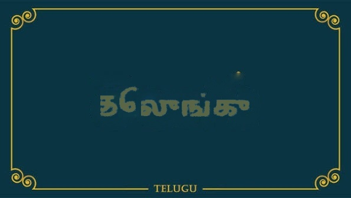

# ReBuild Studio

<p align="center">
  
  
</p>

**Visual scene-text localization and reconstruction for Telugu to Tamil media.**

ReBuild Vision is an end-to-end AI system for translating embedded text within images—such as signboards, posters, notices, road signs, captions, banners, and logos. 

Unlike traditional subtitling or simple box overlays that obscure visual context, ReBuild Studio executes a full 3-stage visual localization and reconstruction pipeline: **detecting original scene text, recognizing it, translating it contextually into Tamil, inpainting the original text away seamlessly, and rendering translated Tamil text with style-aware neural font synthesis and perspective alignment back into the scene.**

---

## Table of Contents

- [Why This Project Exists](#why-this-project-exists)
- [Why Images First, Then Videos](#why-images-first-then-videos)
- [End-to-End Application Pipeline](#end-to-end-application-pipeline)
- [Phase 3 Deep Neural Renderer](#phase-3-deep-neural-renderer)
- [New Web Server (`server.py`) Implementation](#new-web-server-serverpy-implementation)
- [Current Scope & Status](#current-scope--status)
- [Repository Layout](#repository-layout)
- [Setup & Installation](#setup--installation)
- [CLI Usage](#cli-usage)
- [Running the Web Server](#running-the-web-server)
- [OCR Evaluation & Benchmarking](#ocr-evaluation--benchmarking)

---

## Why This Project Exists

India is a highly multilingual nation. A Tamil speaker traveling through Telugu-speaking regions will frequently encounter essential public information in Telugu script: bus destinations, government notices, warning signs, posters, and road directions. This text is embedded directly into the physical environment.

Standard image translation applications place rectangular background blocks or basic system font overlays over detected text. This breaks visual realism and destroys underlying scene textures. ReBuild Studio solves this by reconstructing the visual scene: removing original Telugu ink while preserving natural lighting and textures, then synthesizing Tamil typography that matches the original visual style and geometry.

---

## Why Images First, Then Videos

The long-term goal of ReBuild Studio is video-level visual text translation (text dubbing). However, video introduces complex temporal challenges:

- Tracking non-rigid text regions across frame sequences.
- Preventing frame-to-frame inpainting flicker.
- Maintaining spatial consistency of rendered Tamil text under camera motion and perspective changes.
- Handling dynamic lighting, shadows, and motion blur.

By proving and perfecting the 3-phase pipeline on still images first, the core modules—CRAFT detection, PaddleOCR recognition, Groq LLM translation, TELEA stroke-level inpainting, and PyTorch Neural Rendering—can be reused directly in video processing loops with temporal smoothing.

---

## End-to-End Application Pipeline

The ReBuild Studio architecture comprises three sequential phases:

```text
========================================================================================
                                 INPUT IMAGE
========================================================================================
                                      │
                                      ▼
[PHASE 1: DETECTION, OCR & TRANSLATION]
  ├── CRAFT Text Detection (BBoxes & Quads)
  ├── Box Cleanup, Area Grouping & Purification
  ├── Quad Rectification & PaddleOCR (PP-OCRv5 Telugu model)
  ├── Telugu Area Filtering & Cross-Area OCR Deduplication
  └── Groq LLM Translation (Telugu Normalization -> Tamil Translation)
                                      │
                                      ▼
[PHASE 2: INPAINTING & BACKGROUND RECOVERY]
  ├── Stroke-level Binary Mask Generation (Ink Contour Extraction)
  ├── OpenCV TELEA Inpainting on Original Text Regions
  └── Inpainting Output (Cleaned Background Image)
                                      │
                                      ▼
[PHASE 3: DEEP NEURAL RENDERING & SYNTHESIS]
  ├── Quad Perspective Un-Warping (_warp_quad)
  ├── Glyph Style Exemplar Extraction (_extract_candidates)
  ├── Text Color Estimation (_estimate_style_color_2)
  ├── Tamil Dynamic Layout Engine (_layout_text)
  ├── PyTorch Neural Glyph Generator (generator1.pt / Zi2Zi Style Transfer)
  ├── Paragraph Composition, Colorization & Bounding Box Fitting
  └── Perspective Alignment & Blending onto Inpainted Image
                                      │
                                      ▼
========================================================================================
                 FINAL OUTPUT: render_output/{image_name}/rendered.jpg
========================================================================================
```

### Stage Summary

| Stage | Subsystem | Main Input | Main Output | Key Technology / Model |
|---|---|---|---|---|
| **Phase 1** | Detection | Input BGR Image | Text BBoxes & Quadrilaterals | CRAFT (PyTorch) |
| | Grouping | CRAFT Quads | Grouped Text Areas / Lines | Geometric IoU & Spatial Merging |
| | OCR | Image Crops | Raw & Cleaned Telugu Text | PaddleOCR (`te_PP-OCRv5_mobile_rec`) |
| | Translation | Raw Telugu Text | Contextual Tamil Translation | Groq API (`llama-3.3-70b` / `mixtral-8x7b`) |
| **Phase 2** | Masking | BGR Image + Quads | Ink Stroke Binary Mask | Otsu Adaptive Thresholding & Contours |
| | Inpainting | Image + Stroke Mask | Inpainted Background Image | OpenCV Fast Marching TELEA Algorithm |
| **Phase 3** | Style Extract | Original Image + Quads | Crop Style Exemplars | Perspective Unwarping & Ink Density Scoring |
| | Rendering | Tamil Text + Style | Rendered Scene-Text Image | `Renderer` & PyTorch GAN Generator (`generator1.pt`) |

Each processed image produces two output structures:
1. `output/<image_name>/`: Inpainted background, structured `metadata.json`, and clean `text_results.json`.
2. `render_output/<image_name>/`: Final composite image `rendered.jpg` alongside individual rendered area layers.

---

## Phase 3 Deep Neural Renderer

The rendering system (`scripts/vtt/rendering.py`) replaces removed Telugu text with visually consistent Tamil text rendered directly onto the inpainted background.

### Key Renderer Components & Modules

1. **Neural Generator Network (`generator1.pt`)**:
   - Utilizes a PyTorch-based Deep Convolutional Generator (`netG`) pre-trained for zero-shot character font and style transfer.
   - Evaluates on GPU (`cuda`) if available, falling back automatically to CPU.
   - Takes input glyph structures and transfers character stroke dynamics from extracted Telugu style images into Tamil characters.

2. **Perspective Quad Un-Warping (`_warp_quad`)**:
   - Calculates Euclidean lengths of quadrilateral top/bottom and left/right boundaries.
   - Computes 3x3 perspective transform matrices (`cv2.getPerspectiveTransform`) to un-warp angled scene text quads into straight rectangular patches for accurate character crop extraction.

3. **Style Candidate Extraction (`_extract_style_images` & `_extract_candidates`)**:
   - Applies Otsu thresholding (`cv2.THRESH_OTSU`) and vertical projection analysis to isolate individual source ink characters.
   - Filters candidate glyphs based on height/width constraints (minimum 15x15 px) and scores quads based on ink density (`_score_quad`).

4. **Dominant Color Estimation (`_estimate_style_color_2`)**:
   - Analyzes extracted style patches in BGR color space.
   - Filters out background pixels using luminance thresholds and computes median/mean text ink colors for precise color matching during rendering.

5. **Dynamic Text Layout Engine (`_layout_text`)**:
   - Measures target Tamil text against area bounding box dimensions (`w x h`).
   - Calculates target line counts, line height, and character limits, using `textwrap` to split translated Tamil text into balanced multi-line blocks.

6. **Glyph Synthesis & Paragraph Composition (`_compose_paragraph`)**:
   - Generates individual Tamil character glyph images (`_generate_glyph`) using the neural generator network.
   - Stitches generated glyphs sequentially into unified paragraph masks with custom morphology adjustments (dilation/smoothing).

7. **Colorization, Fitting & Blending (`_colorize_paragraph`, `_fit_to_bbox`, `_paste_paragraph_2`)**:
   - Colors paragraph masks with estimated scene text colors.
   - Resizes paragraph blocks to target bounding boxes and pastes them back onto the inpainted background with seamless alpha blending.

---

## New Web Server (`server.py`) Implementation

The project features a dedicated HTTP web server (`server.py`) that serves as a standalone local web application and backend execution engine.

### Architecture Highlights

- **Standard Library Backend**: Built using Python's `http.server.ThreadingHTTPServer` and `BaseHTTPRequestHandler`, eliminating heavy third-party framework overhead (like Flask or FastAPI).
- **Automated CRAFT Environment Management**:
  - Automatically verifies whether CRAFT detection outputs exist for an uploaded image.
  - If missing, automatically clones `CRAFT-pytorch`, downloads weights via `gdown`, and applies required compatibility patches to `vgg16_bn.py` and `craft.py` for modern `torchvision`.
- **Subprocess Orchestration**:
  - Receives uploaded images through a robust `multipart/form-data` parser (`parse_multipart_data`).
  - Saves images to `data/images/{image_name}.jpg`.
  - Automatically executes CRAFT detection and runs `scripts/run_pipeline.py` via python subprocesses.
- **Embedded Glassmorphism Frontend UI (`HTML_UI`)**:
  - Responsive, dark-mode single-page application built with modern vanilla CSS (`Outfit` typography, gradient accents, blur backdrops).
  - Drag-and-drop file upload with live progress spinners (~10-30s execution time).
  - Real-time comparison displaying the original uploaded image alongside the final rendered output (`render_output/{image_name}/rendered.jpg`).
- **Static Asset Serving**:
  - Built-in secure file server handling `/data/images/`, `/render_output/`, and `/output/` endpoints with MIME-type resolution.

---

## Current Scope & Status

- **Source Language**: Telugu (Script & Scene Text)
- **Target Language**: Tamil
- **Input**: Natural scene images containing Telugu text.
- **Outputs**:
  - Inpainted image (`output/<image_name>/inpainted.jpg`).
  - Rendered composite image (`render_output/<image_name>/rendered.jpg`).
  - Structured pipeline metadata (`output/<image_name>/metadata.json`).
  - Simplified translation records (`output/<image_name>/text_results.json`).
- **Status**:
  - CRAFT text detection & quadrilateral grouping: **Functional**
  - PaddleOCR Telugu recognition on rectified crops: **Functional**
  - Groq LLM contextual translation: **Functional**
  - OpenCV TELEA stroke-level inpainting: **Functional**
  - PyTorch Deep Neural Renderer & Tamil synthesis: **Functional**
  - Local Web Application (`server.py`): **Functional**

---

## Repository Layout

```text
.
├── README.md                      # Primary project overview
├── README2.md                     # Full end-to-end documentation & architecture breakdown
├── TECHNICAL_README.md             # In-depth module code walkthrough
├── instruction_to_run.md           # Step-by-step shell execution commands
├── server.py                      # Standalone HTTP web server & web UI backend
├── generator1.pt                  # Pre-trained PyTorch neural font generator model weights
├── NotoSansTamil-Regular.ttf      # Reference Tamil font asset
├── requirements.txt               # Python package dependencies
├── scripts/
│   ├── run_pipeline.py            # Main end-to-end pipeline CLI launcher
│   ├── benchmark_ocr.py           # Evaluation script comparing OCR engines
│   └── vtt/                       # Core Visual Text Translation library
│       ├── __init__.py            # Package exports
│       ├── detection.py           # CRAFT parsing, deduplication, area grouping
│       ├── ocr.py                 # Quad rectification, PaddleOCR integration
│       ├── translation.py         # Groq LLM normalization & translation
│       ├── inpainting.py          # Ink stroke masking & OpenCV TELEA inpainting
│       ├── rendering.py           # PyTorch Neural Renderer & Tamil synthesis engine
│       └── visualisation.py       # Debug plotting and OpenCV visualization helpers
├── data/images/                   # Input image dataset
├── output/                        # Phase 1 & 2 outputs (inpainted images & metadata)
├── render_output/                 # Phase 3 outputs (final rendered scene images)
├── CRAFT-pytorch/                 # CRAFT detector submodule checkout (git-ignored)
└── models/paddleocr/              # Local PaddleOCR model weight cache (git-ignored)
```

---

## Setup & Installation

### 1. Environment Setup

Create and activate a Python virtual environment:

```powershell
python -m venv vision
vision\Scripts\Activate.ps1
pip install -r requirements.txt
```

### 2. CRAFT Setup

Clone CRAFT-pytorch and download pretrained weights:

```powershell
git clone https://github.com/clovaai/CRAFT-pytorch.git
cd CRAFT-pytorch
gdown https://drive.google.com/uc?id=1YsaQIpqePU3hFPt_4EunNsBbwNUyBRDD
cd ..
```

Apply `torchvision` compatibility patches:

```powershell
(Get-Content CRAFT-pytorch\basenet\vgg16_bn.py) `
  -replace '^from torchvision.models.vgg import model_urls', '# from torchvision.models.vgg import model_urls' `
  | Set-Content CRAFT-pytorch\basenet\vgg16_bn.py

(Get-Content CRAFT-pytorch\craft.py) `
  -replace 'vgg16_bn\(pretrained=True, freeze=True\)', 'vgg16_bn(pretrained=False, freeze=True)' `
  | Set-Content CRAFT-pytorch\craft.py
```

### 3. Model Weights

Ensure `generator1.pt` is located in the root directory. PaddleOCR models (`te_PP-OCRv5_mobile_rec`) will be automatically fetched on first run or placed in `models/paddleocr/`.

---

## CLI Usage

### Running CRAFT Text Detection

Generate detection coordinates for input images:

```powershell
cd CRAFT-pytorch
python test.py --trained_model=craft_mlt_25k.pth --test_folder=../data/images --cuda=True
cd ..
```

### Running Full End-to-End Pipeline (Detection -> OCR -> Translation -> Inpainting -> Renderer)

**Single Image Processing:**

```powershell
python scripts/run_pipeline.py `
  --image data/images/img1.jpg `
  --result CRAFT-pytorch/result/res_img1.txt `
  --api-key YOUR_GROQ_API_KEY
```

**Selective Image Batch Processing:**

```powershell
python scripts/run_pipeline.py `
  --image-dir data/images `
  --result-dir CRAFT-pytorch/result `
  --select img1,img3,img7 `
  --api-key YOUR_GROQ_API_KEY
```

**Smoke Test (Inpainting & Rendering without API key):**

```powershell
python scripts/run_pipeline.py `
  --image-dir data/images `
  --result-dir CRAFT-pytorch/result `
  --select img1 `
  --skip-translate
```

---

## Running the Web Server

Launch the full interactive web server:

```powershell
python server.py
```

Or specify a custom port:

```powershell
python server.py 8080
```

1. Open your browser and navigate to `http://localhost:8000`.
2. Drag and drop any image containing Telugu scene text into the upload dropzone.
3. Enter your Groq API key (or use the built-in default).
4. Click **Run Pipeline & Translate**. The server will automatically perform CRAFT detection, OCR, Groq translation, TELEA inpainting, and Phase 3 Neural Rendering, displaying the original and rendered images side-by-side upon completion.

---

## OCR Evaluation & Benchmarking

To benchmark EasyOCR versus PaddleOCR recognition accuracy on detected CRAFT text crops:

```powershell
python scripts/benchmark_ocr.py `
  --image-dir data/images `
  --result-dir CRAFT-pytorch/result `
  --select img1,img3,img7 `
  --engines easyocr,paddleocr `
  --paddle-cache models/paddleocr `
  --output output/ocr_compare_selected
```

Results are exported to `output/ocr_compare_selected/ocr_comparison.json`.
